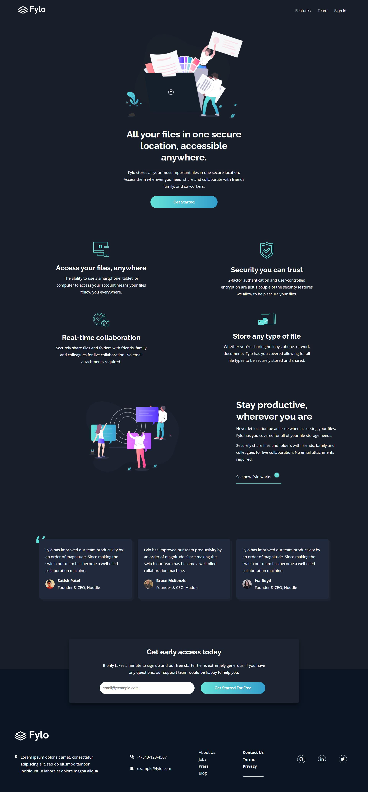

This is a solution to the [Fylo dark theme landing page challenge on Frontend Mentor](https://www.frontendmentor.io/challenges/fylo-dark-theme-landing-page-5ca5f2d21e82137ec91a50fd). 

Frontend Mentor challenges help you improve your coding skills by building realistic projects. 

## Table of contents

- [Overview](#overview)
  - [The challenge](#the-challenge)
  - [Screenshot](#screenshot)
  - [Links](#links)
- [My process](#my-process)
  - [Built with](#built-with)
  - [What I learned](#what-i-learned)
  - [Continued development](#continued-development)
  - [Useful resources](#useful-resources)
- [Author](#author)
- [Acknowledgments](#acknowledgments)

## Overview

This challenged took me exactly 8 days of on and off coding to achieve. It is the coding of the landing page for an abstract company called Fylo.

### The challenge

The challenge for this exercise is:

- For users to see the optimal layout for the site depending on their device's screen size.
- To see hover states for all interactive elements on the page.

### Screenshot

Below is the full image of the screenshot of the designed site all done

### Links
The link to the code and the hosted landing page can be found in the items below;

- Solution URL: [Fylo Design Repo](https://github.com/femidata/Fylo-Landing-page-design)
- Live Site URL: [Fylo Landing Page](https://github.com/femidata/Fylo-Landing-page-design)

## My process
I started with writing the html from begining to finish before i started styling with CSS. This is different from the approach most programmers uses by coding both html and CSS simultaneously.

It was however a challenge i was will to try so i did.

### Built with

The website was built using the following

- HTML
- CSS

### What I learned

I learnt the use of several CSS properties in this project. I understood more the use of *display* and how to move elements using the *z-index*

If you want to learn more about  CSS, visit [W3School](https://www.w3schools.com/css/) for all you need to know about CSS, htlm and any other language.

### Continued development

I hope to learn to brush up on the little challenges i face in replicating the UI design. I will definitely be going back to learn more abt CCS and how best to use selectors.

### Useful resources

- [Learn CSS Grid](https://www.youtube.com/watch?v=jV8B24rSN5o&t=67s) - This helped me understand more about the use of grid.
- [Example resource 2](https://www.example.com) - This is an amazing article which helped me finally understand XYZ. I'd recommend it to anyone still learning this concept.

**Note: Delete this note and replace the list above with resources that helped you during the challenge. These could come in handy for anyone viewing your solution or for yourself when you look back on this project in the future.**

## Author

- Website - [Oluwafemi Odugbesan](https://www.frontendmentor.io/profile/femidata)
- Frontend Mentor - [@yourusername](https://www.frontendmentor.io/profile/femidata)

## Acknowledgments

I want to thank  [Side Hustle](https://https://sidehustle.ng/) for the mentorship. I may not have chosen to learn frontend development if they didnt provide the opportunity to learn for free.
